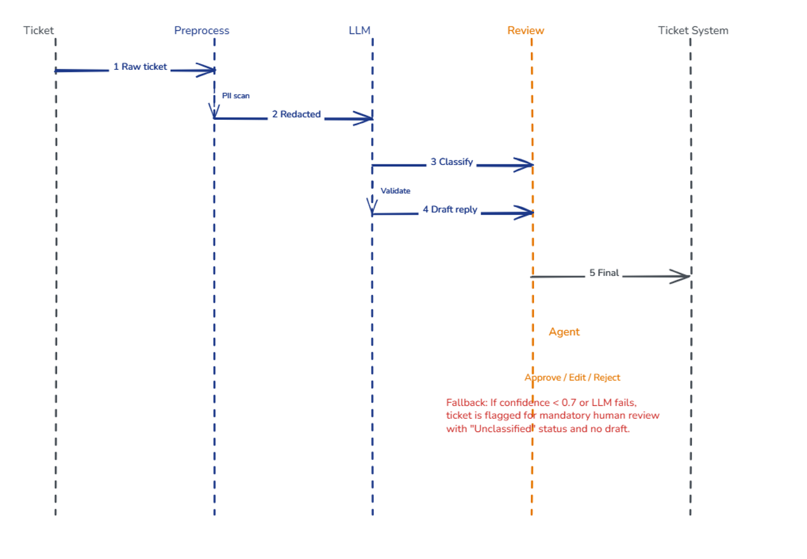
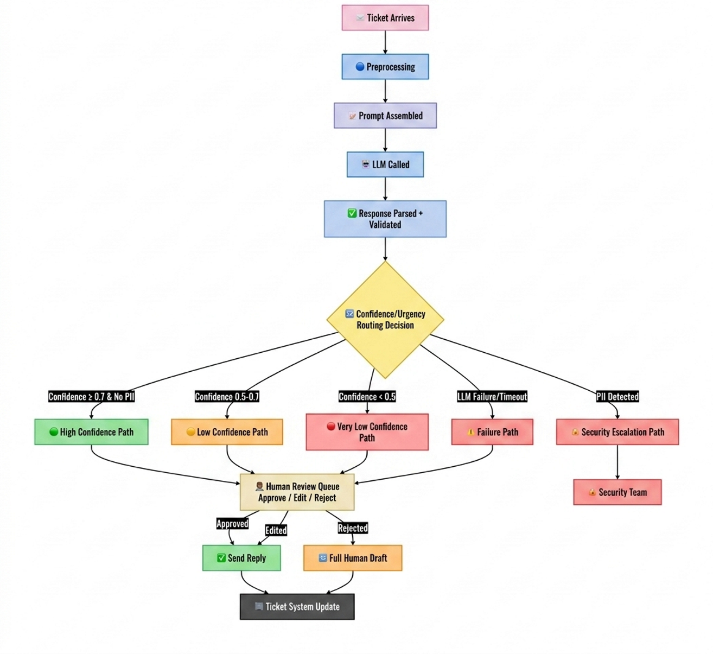

# AI-Powered Ticket Classification & Draft Reply System

## Architecture Overview



---

# HLD (High-Level Design)

## 1. Design Principles

- **Safe fallback**: If LLM confidence is low, the draft is flagged for mandatory human review.
- **Privacy-first**: PII redaction happens before any LLM call; raw data is never sent to third-party models.
- **Human-in-the-loop**: All outgoing replies require agent approval; the LLM only suggests, never auto-sends.
- **Observability**: Every prediction and human edit is logged to improve fine-tuning and prompt engineering.

## 2. Key Decisions

- Async queues between services to handle bursts of thousands of tickets.
- LLM output validation (JSON schema + regex) to prevent hallucinations in urgency/category.
- Redaction audit trail so agents can reveal PII if absolutely necessary (with permission).

## 3. Failure Modes & Mitigations

| Failure | Mitigation |
|---|---|
| LLM API timeout | Retry with exponential backoff; if still fails, route ticket to human with "unclassified" flag. |
| PII over-redaction | Keep original in encrypted storage; agent can view original if needed (audited). |
| Review queue backlog | Auto-escalate tickets with P1 urgency to a dedicated agent pool. |

## 4. Future Extensions

- Fine-tune a smaller open-source model on historical human-approved drafts to reduce API cost.
- Add sentiment analysis to prioritize angry customers.
- Integrate with knowledge base to include relevant articles in the draft reply.

## 5. Success Metrics

- Time-to-first-reply (target < 2 minutes for P1)
- Agent edit rate (target < 20% edits)
- Human-review queue depth (alert if > 50 tickets)

---

# LLD (Low-Level Design)

## Sequence Diagram


## Pipeline Flowchart



## Request Schema

```typescript
interface TicketRequest {
  // Core identifiers
  ticketId: string;                    // UUID, generated by source system
  sourceSystem: "email" | "web" | "slack" | "api" | "other";
  receivedAt: ISO8601Timestamp;        // "2026-08-15T10:30:00Z"

  // Content
  rawText: string;                     // Original text, max 10000 chars
  subject: string;                     // Email subject or short summary
  attachments: AttachmentMetadata[];   // Names, sizes, content-types (not full content)

  // Customer context
  customerTier: "premium" | "business" | "standard" | "trial";
  customerId: string;                  // Anonymized for PII
  previousTickets: PreviousTicket[];   // Last 5 tickets (for context)

  agingMetrics: {
    // TBD: We can use these to increase the effectiveness of the output
    secondsSinceCreation: number;
    secondsSinceLastAgentProcessed: number;
    secondsSinceLastCustomerResponse: number;
    previousSlaBreach: number;
    escalations: number;
  };

  // Routing hints
  preferredLanguage: string;           // "en", "es", "fr", etc.
  region: string;                      // "us-east", "eu-west", etc.
}
```

## Response Schema

```typescript
interface LLMResponse {
  // Classification
  category: "billing" | "technical" | "account" | "feature_request" | "complaint" | "other";
  urgency: "P1" | "P2" | "P3" | "P4";

  // Draft
  draftReply: string;                  // Plain text, max 500 chars
  draftReplyHtml?: string;             // Optional HTML version for rich clients

  // Confidence & metadata
  confidenceScore: number;             // 0.0 – 1.0, based on logits or self-consistency
  modelVersion: string;                // "gpt-4-turbo-2026-04-09" or internal
  inferenceTimeMs: number;             // For performance monitoring

  // Reasoning (for human review)
  reasoning: {
    urgencyRationale: string;          // "Customer is premium and reports outage"
    categoryRationale: string;         // "Keywords: 'payment', 'invoice', 'refund'"
    suggestedActions?: string[];       // ["Check billing history", "Escalate to finance"]
  };

  // Safety
  piiDetected: boolean;                // Did the LLM see any PII? (should be false)
  requiresEscalation: boolean;         // Flag for sensitive topics
}
```

## Total Budget Calculation

Assumptions:
- Total input words in the ticket will be less than 1000 (≈1300 tokens)
- No attachments are sent, so no tokens needed for attachments
- Last 5 tickets read at 5 × 200 words (≈1300 tokens)
- System prompt and classification instructions: 500 tokens
- Customer metadata (tier, language, region): 50 tokens

| Component | Tokens |
|---|---|
| System prompt (classification + draft instructions) | 500 |
| Previous tickets (5 × 200 words) | 1,300 |
| Current ticket text | 1,300 |
| Customer metadata (tier, language, region) | 50 |
| **Total input** | **~3,150 tokens** |
| Plus 20% buffer | ~3,800 tokens |
| **Max input cap** | **~4,000 tokens** |
| Reserved output tokens | ~1,000 tokens |
| **TOTAL TOKENS** | **~5,000 tokens** |

### Why these numbers?

| Decision | Justification |
|---|---|
| 4,000 max input | Covers 99th percentile of tickets while keeping latency low (< 3s) |
| 1,000 reserved output | Draft replies should be concise (2–3 sentences ≈ 50–80 words → 100–150 tokens). Extra room for reasoning fields. |
| 1,300 tokens for previous tickets | Provides enough context without overloading the model; 5 tickets is the sweet spot for continuity. |
| 20% buffer | Handles unexpected length spikes and system prompt variations. |

## Fallback Logic

| Condition | Action | Draft Sent? | Review Required? |
|---|---|---|---|
| Confidence ≥ 0.7 | Proceed | ✅ Yes | ✅ Yes (always) |
| Confidence 0.5–0.7 | Flag low confidence | ❌ No | ✅ Yes (mandatory) |
| Confidence < 0.5 | Manual only | ❌ No | ✅ Yes |
| LLM timeout (after retries) | Fallback to manual | ❌ No | ✅ Yes |
| Invalid JSON | Parse error → manual | ❌ No | ✅ Yes |
| PII detected | Security escalation | ❌ No | 🔒 Security team |
| Queue > 200 | P1 urgent priority | ✅ Yes (P1 only) | ✅ Yes (expedited) |

## Pipeline Logic

| Step | Action | Key Checks | Output |
|---|---|---|---|
| 1 | Ticket arrives → Preprocessing | PII redaction, normalization | Redacted ticket |
| 2 | Prompt assembled → LLM called | Token budget, retry logic | Raw LLM output |
| 3 | Response parsed + validated | JSON schema, enum validation | Validated response |
| 4 | Confidence/urgency routing | PII check, confidence tiers | Routing decision |
| 5 | Human handling | Queue assignment, priorities | Review queue entry |

## PII Redaction Flow

**Raw Ticket**
- Incoming customer support ticket

**Step 1: Pattern Matching (Regex)**
- Email: `[a-zA-Z0-9._%+-]+@[a-zA-Z0-9.-]+\.[a-zA-Z]+`
- Phone: `\+?[0-9]{1,3}[-. ]?[0-9]{3}[-. ]?[0-9]{4}`
- SSN: `\d{3}-\d{2}-\d{4}`
- Credit Card: `\d{4}[- ]?\d{4}[- ]?\d{4}[- ]?\d{4}`

**Step 2: NER (spaCy / Transformers)**
- PERSON: John Smith
- ORG: Acme Corporation
- GPE: New York
- DATE: March 15th

**Step 3: Contextual Redaction**
- Understand the context before redacting
- Preserve meaningful business information
- Replace sensitive data with:
  - `[REDACTED: PERSON]`
  - `[REDACTED: EMAIL]`
  - `[REDACTED: PHONE]`
  - `[REDACTED: CREDIT_CARD]`
- Generate an audit log of redacted fields

**Step 4: LLM Call (PII-Free)**
- Send only redacted text to the LLM
- Store raw ticket data in encrypted storage
- Allow authorized agents to view the original ticket
- Keep PII outside the LLM processing path

## Decision Log

| ID | Category | Decision | Rationale | Impact | Alternatives Considered | Decision Makers |
|---|---|---|---|---|---|---|
| DEC-1 | Token Budget | Set max input tokens at 4,000 with 1,000 reserved for output (5,000 total) | Balances context richness with latency (< 3s). Covers 99th percentile of tickets (1,000 words text + 5 previous tickets + system prompt) while maintaining cost efficiency. 20% buffer handles unexpected spikes. | Cost: ~$0.01–0.03 per request. Latency: Under 3 seconds for P95. Quality: Sufficient context for accurate classification. | 8,000 tokens (higher cost, higher latency) or 2,000 tokens (insufficient context for previous tickets). | Engineering Lead, ML Lead |
| DEC-2 | Human-in-Loop | All outgoing replies require agent approval — NEVER auto-send | Non-negotiable due to: 1) Customer trust — one bad LLM response can damage brand reputation; 2) Legal compliance — liability for incorrect advice; 3) Quality control — LLMs hallucinate; 4) Personalization — agents add empathy and nuance; 5) Training data — human edits provide feedback for fine-tuning. | Agent reviews all drafts (100% coverage). High-confidence drafts (≥0.9) could auto-send in overflow scenarios only. | Fully automated (high risk, rejected). Auto-send for P4 only (still risky). | Product Lead, Legal, Security Lead |
| DEC-3 | PII Redaction | Apply regex + NER redaction BEFORE any LLM call | Compliance with GDPR/CCPA; prevents data leakage to third-party LLM providers; protects customer privacy; audit trail for security teams. | Multi-layer approach: Regex for patterns (email, phone, SSN) + spaCy NER for contextual PII (names, organizations, locations). | Complete blocking of tickets with PII (impacts customer experience). Manual redaction (not scalable). | Security Lead, Privacy Officer |
| DEC-4 | Confidence Threshold | Set confidence threshold at 0.7 for draft usage, 0.5 for fallback | Optimal balance: 0.7 ensures high-quality drafts for 85% of tickets. 0.5–0.7 flags for manual review without draft (prevents low-quality suggestions). <0.5 routes immediately to human. | Threshold 0.8 (too conservative, reduces automation). Threshold 0.6 (too aggressive, risks quality). | 0.7 based on internal testing and industry standards (OpenAI, Anthropic guidelines). | ML Lead, Product Lead |
| DEC-5 | Queue Overflow | When queue > 200, auto-send P1 drafts with confidence > 0.9 | Prevents complete system stall. P1 tickets (highest urgency) get expedited processing. High confidence threshold (0.9) minimizes risk. Senior agents get push notifications. | No auto-send ever (queue backlog could reach hours). Auto-send all P1 regardless of confidence (too risky). | 200 tickets = ~2 hours of agent capacity. Escalation at 200 prevents customer SLA breaches. | Operations Lead, Engineering Lead |
