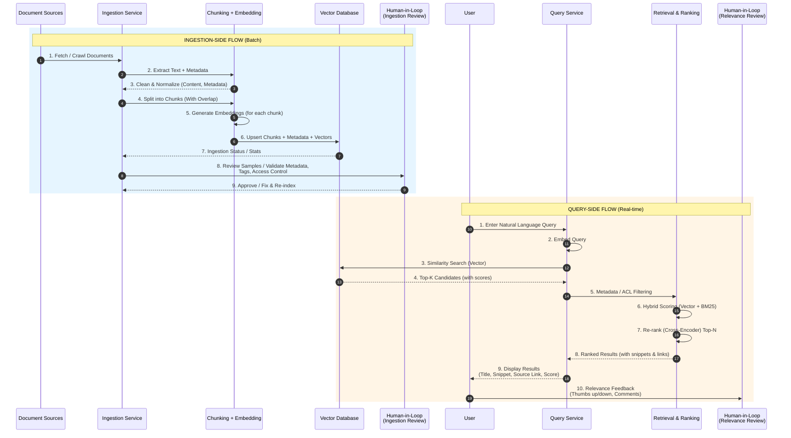

# Semantic Search for Internal Engineering Documentation
## HLD • LLD • Sequence Diagram • Chunk Schema • Chunking Strategy • Decision Log

---

## 1. High-Level Design (HLD)

**Short Description**  
The High-Level Design shows the end-to-end architecture of the semantic search system for internal engineering documentation. It covers document sources, batch ingestion, vector storage, real-time query processing, ranking, and human-in-the-loop feedback loops.

### Key Components

| Component | Description |
|-----------|-------------|
| **Document Sources** | Download from internet |
| **Ingestion Pipeline (Batch)** | Connectors/Crawlers, Change Detection, Document Fetch, Metadata Extraction |
| **Chunking + Embedding** | Clean & Normalize → Chunk (800–1000 tokens) → Overlap → Generate Embeddings |
| **Vector Database** | Stores Embeddings, Document Chunks, Metadata, ACL/Permissions (ChromaDB) |
| **Query Service** | Embed Query → Similarity Search → Hybrid Search → Metadata/ACL Filter → Re-rank → Top-K Results |
| **Results** | Top relevant documents with Title, Snippet, Source Link, Score |

### Human-in-the-Loop
- **Ingestion Review**: Validate metadata, tags, exclude sensitive content
- **Quality Feedback Loop**: Mark results good/bad, improve relevance, update chunking/metadata
- **Relevance Review (Sampled)**: Validate ranking quality, adjust re-rank model, track evaluation set

### Why this is a GenAI problem (not rules-engine)
- User queries are natural language and highly variable
- Semantic meaning matters more than exact keywords
- Embeddings capture meaning and relationships beyond simple keyword matching
- Rules-based systems require brittle synonym lists that are hard to maintain at scale
- Retrieval + semantic ranking generalizes to unseen queries and improves with feedback

---

## 2. Low-Level Design (LLD)

**Short Description**  
The Low-Level Design details the sequence flows for both ingestion and query paths, the chunk metadata schema, chunking strategy, and vector database comparison for the internal use case.

### Ingestion-Side Flow (Batch)
1. Fetch / Crawl Documents  
2. Extract Text + Metadata  
3. Clean & Normalize  
4. Split into Chunks (with Overlap)  
5. Generate Embeddings (for each chunk)  
6. Upsert Chunks + Metadata + Vectors  
7. Ingestion Status / Stats  
8. Review Samples / Validate Metadata, Tags, Access Control  
9. Approve / Fix & Re-index  

### Query-Side Flow (Real-time)
1. Enter Natural Language Query  
2. Embed Query  
3. Similarity Search (Vector)  
4. Top-K Candidates (with scores)  
5. Metadata / ACL Filtering  
6. Hybrid Scoring (Vector + BM25)  
7. Re-rank (Cross-Encoder) Top-N  
8. Ranked Results (with snippets & links)  
9. Display Results (Title, Snippet, Source Link, Score)  
10. Relevance Feedback (Thumbs up/down, Comments)

### Recommended Vector DB
**ChromaDB (Self-hosted)** – chosen for cost efficiency, data residency, ease of setup on Windows, and sufficient scale for internal use. Can migrate later to Pinecone or Weaviate if needed.

---

## 3. Sequence Diagram

### Ingestion-Side Flow (Batch) + Query-Side Flow (Real-time)

---

## 4. Chunk Metadata Schema

| Field            | Type          | Description                                      |
|------------------|---------------|--------------------------------------------------|
| `chunkId`        | string (UUID) | Unique ID of the chunk                           |
| `sourceDocId`    | string        | ID of the source document                        |
| `sourceDocTitle` | string        | Title of the source document                     |
| `docType`        | enum          | `design_doc` \| `runbook` \| `postmortem` \| `guide` \| `faq` \| `other` |
| `team`           | string        | Owning team / domain                             |
| `service`        | string        | Related service / component                      |
| `filePath`       | string        | Path or URL to the document                      |
| `sourceSystem`   | enum          | `confluence` \| `git` \| `sharepoint` \| `s3`   |
| `chunkIndex`     | int           | Order of chunk in the document                   |
| `chunkText`      | string        | Text content of the chunk                       |
| `embeddingVector`| float[]       | Dense vector for the chunk                       |
| `tokens`         | int           | Number of tokens in chunk                        |
| `charCount`      | int           | Character count of chunk                         |
| `metadata`       | json          | Additional key-value metadata (labels, tags, custom fields) |
| `accessGroups`   | string[]      | Groups/roles allowed to access                   |
| `lastUpdated`    | datetime      | Last time this chunk was updated                 |
| `createdAt`      | datetime      | When chunk was created                           |
| `checksum`       | string        | Hash of chunkText (for dedup / change detection) |

---

## 5. Chunking Strategy

### Document Types
Design docs, Runbooks, Postmortems, Guides  
(typically long-form, structured with headings, lists, code blocks, tables)

### Target Parameters

| Parameter          | Value                     |
|--------------------|---------------------------|
| **Chunk Size**     | 800 – 1,000 tokens        |
| **Overlap**        | 150 – 200 tokens (~20%)   |

### Why this size?

- **Large enough** to preserve full context (paragraphs, recovery steps, examples, code blocks).
- **Small enough** for embedding models (e.g. `text-embedding-3-large` supports up to 8k tokens; we keep chunks well below the maximum).
- Works well for semantic retrieval without losing meaning.
- Balances retrieval precision against storage cost.

### Why overlap?

- Prevents **boundary loss** (a concept split across two chunks).
- Improves recall for queries where key terms appear near the edge of a chunk.
- ~20% is a practical sweet spot used widely in production RAG systems.

### Chunking Rules

| Rule | Description |
|------|-------------|
| Prefer semantic boundaries | Split on headings (H1/H2), section breaks |
| Do **not** split | Lists, tables, code blocks, or numbered steps |
| Long sections | If a section > 1,200 tokens → split by sub-headings or natural paragraph breaks |
| Metadata enrichment | Extract headings, labels, tags, service, team, doc type |
| Hierarchy | Store hierarchy path (e.g. `H1 > H2 > H3`) for better filtering |

### Justification Summary

| Concern | Decision | Reason |
|---------|----------|--------|
| Context preservation | 800–1000 tokens | Keeps complete operational steps and examples intact |
| Embedding efficiency | Well under 8k limit | Avoids truncation and maintains embedding quality |
| Boundary problems | 20% overlap | Reduces loss of meaning at chunk edges |
| Structure respect | Heading-aware + no-split rules | Engineering docs lose value when lists/code/steps are broken |
| Future filtering | Rich metadata + hierarchy | Enables team/service/docType filters and better ranking |

---

## 6. Decision Log

| ID | Category | Decision | Rationale | Impact | Alternatives Considered | Decision Makers |
|---|---|---|---|---|---|---|
| DEC-1 | Chunking Strategy | Use 800–1,000 token chunks with 150–200 token overlap (~20%) and structure-aware splitting (prefer headings, never split lists/tables/code blocks) | Engineering docs are long-form and structured. This size preserves complete steps, examples, and context while staying well under the embedding model limit (text-embedding-3-large supports 8k). Overlap prevents boundary loss. Structure rules keep semantic units intact. | Higher retrieval quality for operational queries. Slightly more vectors stored (acceptable at internal scale). Consistent chunk quality across design docs, runbooks, and postmortems. | 200–400 tokens (too fragmented, loses context). 1,500–2,000+ tokens (exceeds optimal embedding window, lower precision). Fixed-size only with no structure awareness. | Engineering Lead, ML Lead |
| DEC-2 | Vector Database | Use ChromaDB (self-hosted) for MVP | Internal-only system prioritizes cost, data residency, and simplicity. Chroma is free, easy to run on Windows, requires no external account, and scales sufficiently for hundreds of thousands to a few million chunks. Clear migration path exists if advanced features are needed later. | Zero infrastructure cost. Data never leaves the company network. Fast local development and testing. Limited native hybrid search (Vector + BM25) may need external support later. | Pinecone (excellent scale & hybrid search but ongoing cost and data leaves environment). Weaviate (rich features but higher operational complexity). Elasticsearch k-NN (already in stack but heavier for pure vector use case). | Engineering Lead, Architecture |
| DEC-3 | Staleness / Sync Strategy | Detect changes via checksum + lastModified, soft-delete old chunks by `sourceDocId`, then re-chunk → re-embed → upsert. On hard delete, remove all chunks for that `sourceDocId`. | Source systems (Confluence, Git, SharePoint, S3) change frequently. Full re-ingestion is too expensive. Checksum-based detection is reliable across all sources. Soft-delete + re-index keeps the index consistent without complex incremental logic. | Near real-time freshness with low operational cost. Temporary inconsistency window exists between source change and re-index (acceptable for internal docs). Requires storing `checksum` and `sourceDocId` on every chunk (already implemented). | Full re-index on every change (too costly). Pure incremental patch of individual chunks (complex and error-prone). Polling-only without checksum (misses some updates). | Engineering Lead, Platform Team |

---