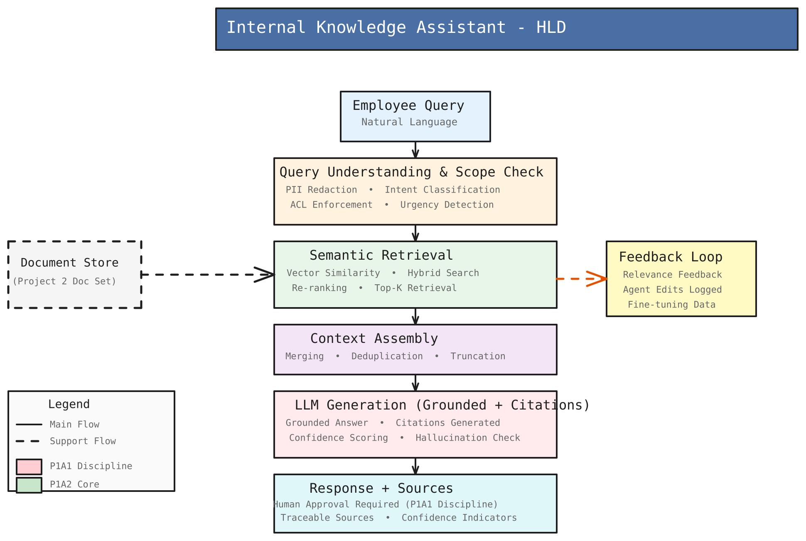
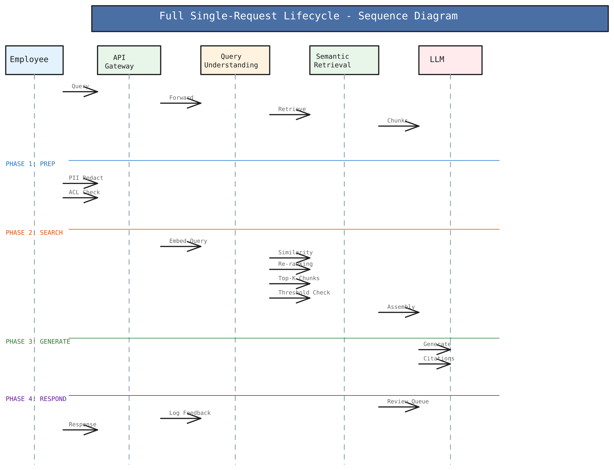

# Internal Knowledge Assistant — Architecture & Design

---

## 1. High-Level Design



The system is a **Retrieval-Augmented Generation (RAG)** pipeline. An employee asks a question in natural language; the system finds the most relevant internal documents, assembles them into a grounded context, and generates a cited answer — never making claims beyond what the documents say.

```
┌─────────────────────────────────────────────────────────┐
│                    Employee Query                        │
│              (natural language question)                 │
└───────────────────────────┬─────────────────────────────┘
                            │
                            ▼
┌─────────────────────────────────────────────────────────┐
│           Query Understanding & Scope Check              │
│  • PII Redaction    • Intent Classification             │
│  • ACL Enforcement  • Urgency Detection                 │
└───────────────────────────┬─────────────────────────────┘
                            │
               ┌────────────▼────────────┐
               │                         │ ◄── Document Store
┌──────────────▼──────────────────────┐  │     (Project Doc Set)
│         Semantic Retrieval           │  │
│  • Vector Similarity  • Hybrid Search│──┘
│  • Re-ranking         • Top-K        │ ──► Feedback Loop
└───────────────────────┬─────────────┘     • Relevance signals
                        │                   • Agent edits
                        ▼                   • Fine-tuning data
┌─────────────────────────────────────────────────────────┐
│                  Context Assembly                        │
│         Merging  •  Deduplication  •  Truncation        │
└───────────────────────────┬─────────────────────────────┘
                            │
                            ▼
┌─────────────────────────────────────────────────────────┐
│          LLM Generation (Grounded + Citations)           │
│  • Grounded answer    • Citations generated              │
│  • Confidence scoring • Hallucination check              │
└───────────────────────────┬─────────────────────────────┘
                            │
                            ▼
┌─────────────────────────────────────────────────────────┐
│                  Response + Sources                      │
│  Human Approval Required  •  Traceable Sources           │
│  Confidence Indicators                                   │
└─────────────────────────────────────────────────────────┘
```

### Stage explanations

**Query Understanding & Scope Check**
Before the query touches any documents it is sanitized and scoped. PII (emails, phone numbers, SSNs) is redacted so sensitive data never enters retrieval or generation. Intent classification and urgency scoring tell downstream components how to prioritise the request. ACL enforcement would filter which documents a given user/role is allowed to see.

**Document Store → Semantic Retrieval**
The document store is the knowledge base — a collection of text chunks, each with metadata (source, title, section, URL). Retrieval converts the query into a vector and finds the top-K most similar chunks using cosine similarity. A hybrid re-ranking pass then blends vector similarity (60%), keyword overlap (30%), and recency (10%) to produce a final ranking. The dashed arrow from Document Store shows it feeds retrieval as a support flow, not a step the query passes through sequentially.

**Feedback Loop**
After the user rates a response, the signal (positive/negative) is recorded against the chunk IDs that were cited. On the next search those chunks receive a small score boost or penalty. Over time this nudges frequently-helpful content higher and frequently-unhelpful content lower — without retraining anything. The "Fine-tuning Data" label on the HLD indicates that accumulated feedback can also be exported as training signal for a future model update.

**Context Assembly**
The top-K retrieved chunks are not passed to the LLM as-is. They are deduplicated (Jaccard similarity to drop near-identical passages), re-ranked by combined score, and then packed greedily into the available token budget. If a chunk is too large to fit it is trimmed at sentence level, keeping the highest-scoring sentences first.

**LLM Generation**
A strict system prompt instructs the model to answer *only* from the provided context, cite every claim with a `[C1]`, `[C2]` marker, and explicitly say "I cannot answer" if the context is insufficient. This is the grounding contract. After generation, the citation engine validates each marker and resolves it to a full source record (title, section, URL).

**Response + Sources**
The final answer carries confidence indicators and a formatted sources list. In the full design a human reviewer approves the answer before it is delivered for high-stakes queries. The response is traceable — every sentence that makes a factual claim points back to the document it came from.

### HLD → Code mapping

| Stage | Class(es) | Status |
|---|---|---|
| Employee Query | `model.Query` | ✅ Built from CLI input |
| Query Understanding | `query.QueryProcessor`, `util.PIIRedactionUtil` | ⚠️ PII redaction only — intent, ACL, urgency are stubbed |
| Document Store | `store.VectorStoreService` / `InMemoryVectorStoreService` | ✅ Pluggable interface; in-memory default |
| Semantic Retrieval | `store.InMemoryVectorStoreService`, `store.HashingEmbeddingService` | ⚠️ Hashing-trick embedding, not a real semantic model |
| Re-ranking | `context.ContextAssembler.rankChunks()` | ✅ Hybrid score (similarity + keyword + freshness) |
| Feedback Loop | `feedback.FeedbackService` | ⚠️ Score nudge only — no export, no edit logging |
| Context Assembly | `context.ContextAssembler` | ✅ Dedup, rank, token-budget trim |
| LLM Generation | `prompt.SystemPrompt`, `citation.CitationEngine` | ⚠️ Prompt is real; LLM call is a stand-in |
| Response + Sources | `format.ResponseFormatter`, `model.LLMResponse` | ⚠️ No human-approval queue |

---

## 2. Low-Level Design — Single Request Lifecycle



One call to `KnowledgeAssistant.processQuery(Query, topK)` drives all four phases.

```
Employee        KnowledgeAssistant      VectorStore / Assembler      LLM (stub)
    │                   │                         │                      │
    │── query ─────────►│                         │                      │
    │                   │                         │                      │
    │          ── PHASE 1: PREP ──────────────────────────────────────── │
    │                   │                         │                      │
    │                   │  QueryProcessor.process()                      │
    │                   │  • PIIRedactionUtil strips PII from query text  │
    │                   │  • QueryMetadata built (intent, urgency stubs)  │
    │                   │                         │                      │
    │          ── PHASE 2: SEARCH ────────────────────────────────────── │
    │                   │                         │                      │
    │                   │── search(text, topK) ──►│                      │
    │                   │                         │ embed query (HashingEmbeddingService)
    │                   │                         │ cosine similarity against all chunks
    │                   │                         │ feedback boost applied per chunk
    │                   │                         │ sort descending → top-K returned
    │                   │◄── List<Chunk> ─────────│                      │
    │                   │                         │                      │
    │                   │  FallbackHandler.handleNoMatch()               │
    │                   │  • all below 0.65 → FAQ search → LOW_CONFIDENCE│
    │                   │  • 0.55–0.65 → NEAR_THRESHOLD partial answer   │
    │                   │  • empty → NO_CHUNKS escalation message        │
    │                   │                         │                      │
    │                   │  ContextAssembler.assembleContext()            │
    │                   │  • deduplicateChunks()  Jaccard > 0.7 = drop  │
    │                   │  • rankChunks()         0.6·sim + 0.3·kw + 0.1·freshness
    │                   │  • filterByThreshold()  below 0.65 flagged    │
    │                   │  • optimizeForTokenBudget() greedy pack        │
    │                   │  • trimChunkToFit()     sentence-level if needed
    │                   │                         │                      │
    │          ── PHASE 3: GENERATE ─────────────────────────────────── │
    │                   │                         │                      │
    │                   │  SystemPrompt.buildContextPrompt()             │
    │                   │  • injects [C1], [C2] labelled passages        │
    │                   │  • enforces: cite every claim, say "I can't    │
    │                   │    answer" if context is insufficient          │
    │                   │                         │                      │
    │                   │── prompt ───────────────────────────────────  ►│
    │                   │◄── raw response with [C#] markers ─────────── │
    │                   │                         │                      │
    │                   │  CitationEngine.processCitations()             │
    │                   │  • regex extracts all [C#] positions           │
    │                   │  • maps each to Source (title, section, URL)   │
    │                   │  • appends formatted Sources section           │
    │                   │                         │                      │
    │          ── PHASE 4: RESPOND ──────────────────────────────────── │
    │                   │                         │                      │
    │                   │  ResponseFormatter.formatForUI()               │
    │                   │  • adds confidence warning if score < 0.6      │
    │                   │  • adds fallback note if isFallback = true     │
    │                   │                         │                      │
    │◄── formatted response + sources ──────────  │                      │
    │                   │                         │                      │
    │  "Helpful? (y/n)" │                         │                      │
    │── feedback ───────►  submitFeedback(chunkId, POSITIVE/NEGATIVE)    │
    │                   │  FeedbackService.recordFeedback()              │
    │                   │  affects next search's cosine score            │
```

### Phase-by-phase detail

**Phase 1 — Prep**
`QueryProcessor` is the only component that runs before retrieval. It calls `PIIRedactionUtil` which applies three regex patterns (email, phone, SSN) and replaces matches with `[REDACTED_*]`. The redacted text replaces `query.text` so nothing sensitive flows downstream. `Query.QueryMetadata` is attached here — currently `intent = "GENERAL_QUERY"` and `urgencyScore = 0.5` for all queries; these are the two stubs most worth replacing first.

**Phase 2 — Search**
`InMemoryVectorStoreService.search()` embeds the query using `HashingEmbeddingService` (a bag-of-words hashing approach: each token is hashed into a 256-bucket vector, then L2-normalised). Every stored chunk is embedded the same way and ranked by cosine dot product (≡ cosine similarity on normalised vectors). The feedback service injects `0.1 × feedbackScore` on top of each chunk's similarity before sorting, so user-validated chunks float up over time.

`ContextAssembler` then runs four passes in sequence: deduplication (drops any chunk with Jaccard similarity > 0.7 to an already-selected chunk), combined-score ranking (blends the three signals), threshold filtering (marks chunks below 0.65 as low-confidence), and token-budget packing (greedily fills available tokens, trimming the last chunk at sentence level if it doesn't fit whole).

`FallbackHandler` intercepts before the LLM step. It checks the top chunk's combined score: above 0.65 → proceed; 0.55–0.65 → return a `NEAR_THRESHOLD` partial answer; below 0.55 → search the FAQ list → if nothing matches, return a `LOW_CONFIDENCE` or `NO_CHUNKS` message with escalation suggestions.

**Phase 3 — Generate**
`SystemPrompt.buildContextPrompt()` builds the full prompt: the system-level grounding rules (cite everything, use only provided context, say "I cannot answer" if it's not there), followed by the numbered context passages (`[C1]: <text>  Source: ...`), followed by the question. This prompt is what you would send to a real LLM. In the current code `buildResponseFromContext()` stands in for the LLM call — it formats each retrieved passage as a bullet with its citation marker. Swap this one method for an actual API call (OpenAI, Anthropic, Bedrock, etc.) to go live.

`CitationEngine` post-processes the raw response with a regex `\[C(\d+)\]`, maps each match to the corresponding `Source` record, optionally formats as superscript or numeric, and appends a `**Sources:**` footer section.

**Phase 4 — Respond**
`ResponseFormatter` applies two conditional banners — a medium-confidence warning (score < 0.6) and a fallback note — then returns the string. The CLI prints it and prompts for y/n feedback. That signal goes to `FeedbackService.recordFeedback(chunkId, signal)` which increments an atomic counter per chunk. The next time any query retrieves those chunks, `getScore()` returns `(positive - negative) / total` in [-1, +1], scaled by 0.1 and added to the cosine score. Small but cumulative.

---

## 3. Design Patterns

| Pattern | Where | Effect |
|---|---|---|
| RAG | Full `processQuery` pipeline | Answers grounded in supplied docs, not model memory |
| Enforced grounding + citations | `SystemPrompt` rules + `CitationEngine` | Every claim traceable; hallucination surface reduced |
| Strategy (pluggable backends) | `VectorStoreService`, `EmbeddingService` interfaces | Swap DB or embedding model without touching the pipeline |
| Hybrid retrieval + re-ranking | `ContextAssembler.rankChunks()` | Better relevance than vector similarity alone |
| Token-budget context compaction | `ContextAssembler.optimizeForTokenBudget()` | Maximises useful context within a fixed model window |
| Fallback chain | `FallbackHandler` (4 tiers) | Never returns nothing; degrades gracefully with explanation |
| Lightweight feedback loop | `FeedbackService` → score nudge in retrieval | "Learn from reactions" without retraining |
| PII guardrail | `PIIRedactionUtil` in `QueryProcessor` | Sensitive data stripped before retrieval or generation |

### Not yet implemented (present in the HLD/LLD diagrams)

- **ACL-aware retrieval** — filter chunks by requester role/department
- **Real embedding model** — replace `HashingEmbeddingService` with a semantic model
- **Real LLM call** — replace `buildResponseFromContext()` with an API call
- **Hallucination check** — post-generation verification against context
- **Human approval queue** — review gate for high-stakes responses
- **Persistent vector store** — pgvector / Pinecone / Weaviate so docs survive restarts
- **Feedback export** — write accumulated signals to a file/DB for fine-tuning

---

## 4. Package Map

```
com.internal.knowledge
├── KnowledgeAssistant       Orchestrator + CLI (main entry point)
├── model/                   Data classes — Query, Chunk, ContextResult,
│                            Citation, Source, LLMResponse, FallbackResponse, FAQDocument
├── util/                    Stateless helpers — TokenEstimator,
│                            TextSimilarityUtil, PIIRedactionUtil
├── query/                   QueryProcessor — PII redaction, metadata
├── store/                   VectorStoreService (interface)
│                            InMemoryVectorStoreService, EmbeddingService (interface)
│                            HashingEmbeddingService
├── feedback/                FeedbackService, FeedbackSignal
├── context/                 ContextAssembler — dedup, rank, trim
├── prompt/                  SystemPrompt — grounding rules + prompt builder
├── fallback/                FallbackHandler — 4-tier fallback chain
├── citation/                CitationEngine — [C#] extraction + source mapping
└── format/                  ResponseFormatter — UI / email formatting
```

---

## 5. Build & Run

```bash
mvn clean package
java -cp target/classes com.internal.knowledge.KnowledgeAssistant
```

The CLI will prompt you to enter any number of documents (text, source, title, section, URL), then ask for your question. There is no hardcoded demo data — the assistant works against whatever you supply.
