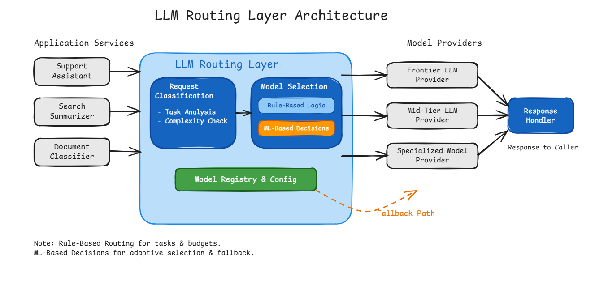
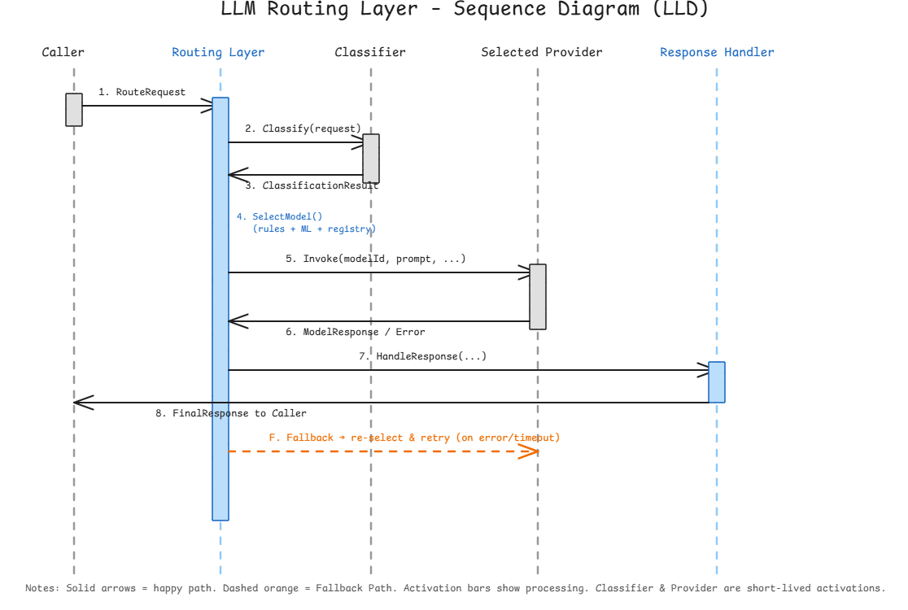

# LLM Routing Layer

A production-oriented routing layer that sits between application services and multiple LLM providers. It selects the right model for each request based on task type, complexity, latency budget, cost ceiling and required capabilities, and provides automatic fallback when a provider is slow, rate-limited or returns an error.

---

## Table of Contents

1. [High-Level Design (HLD)](#1-high-level-design-hld)
2. [Low-Level Design (LLD)](#2-low-level-design-lld)
3. [Design Decisions](#3-design-decisions)
4. [Proof-of-Concept](#4-proof-of-concept)
5. [Artifacts](#5-artifacts)

---

## 1. High-Level Design (HLD)

### 1.1 Goal

Balance **cost**, **latency** and **answer quality** across a heterogeneous set of LLM providers while remaining resilient to provider degradation.

### 1.2 Context Diagram



> Source: `LLM_Routing_Layer_Architecture.excalidraw`

### 1.3 Core Components

| Component | Responsibility |
|-----------|----------------|
| **Request Classification** | Determines task type, complexity and required capabilities from the incoming request. |
| **Model Selection** | Combines rule-based logic and optional ML signals to pick the best model from the registry. |
| **Model Registry & Config** | Single source of truth for every available model (cost, latency, capabilities, health). |
| **Response Handler** | Normalises provider responses, applies any post-processing and returns a uniform payload to the caller. |
| **Fallback Path** | On error / timeout / rate-limit, re-selects a model under degraded constraints and retries. |

### 1.4 Routing Policy Summary

| Feature | Default Model | Fallback | Notes |
|---------|---------------|----------|-------|
| Support Assistant | Frontier (complex) / Mid-tier (FAQ) | Mid-tier | Escalate only when complexity is high |
| Search Summarizer | Mid-tier | Frontier | Frontier only when ambiguity is detected |
| Document Classifier | Specialized / small model | Embedding + rules | Batch-oriented, cost-first |

### 1.5 Benefits

- **Cost control** – expensive models are used only when the request warrants them.
- **Latency optimisation** – low-complexity requests are served by fast models.
- **Resilience** – automatic fallback when a provider degrades.
- **Extensibility** – new models are added by updating the registry; no code changes required.

---

## 2. Low-Level Design (LLD)

### 2.1 Sequence Diagram



> Source: `LLM_Routing_LLD_Sequence.excalidraw`

**Happy-path steps**
1. Caller → Routing Layer: `RouteRequest`
2. Routing Layer → Classifier: `Classify(request)`
3. Classifier → Routing Layer: `ClassificationResult`
4. Routing Layer (internal): `SelectModel()` using rules + ML + registry
5. Routing Layer → Selected Provider: `Invoke(modelId, prompt, params)`
6. Selected Provider → Routing Layer: `ModelResponse` or `Error`
7. Routing Layer → Response Handler: `HandleResponse(...)`
8. Response Handler → Caller: `FinalResponse`

**Fallback path (F)**  
On timeout, rate-limit or error from step 6 the Routing Layer re-enters `SelectModel` with degraded constraints and retries (see §2.5).

### 2.2 Routing Request Schema

```json
{
  "requestId": "string (UUID)",
  "taskType": "enum",
  "prompt": "string",
  "messages": [
    { "role": "user|assistant|system", "content": "string" }
  ],
  "maxLatencyMs": "number (int)",
  "qualityTier": "economy | standard | premium | frontier",
  "maxCostCents": "number (optional)",
  "requiredCapabilities": ["string"],
  "userId": "string (optional)",
  "fallbackPolicy": "strict | degrade | best_effort",
  "metadata": {
    "sourceService": "string",
    "traceId": "string"
  }
}
```

| Field | Justification |
|-------|---------------|
| `requestId` | Idempotency, tracing, correlation |
| `taskType` | Primary signal for rule-based routing |
| `prompt` / `messages` | Payload; length used for context-window matching |
| `maxLatencyMs` | Hard upper bound – prefers lower-latency models when tight |
| `qualityTier` | Explicit caller preference; overrides pure cost optimisation |
| `maxCostCents` | Budget guardrail |
| `requiredCapabilities` | Must be a subset of the model’s capability tags |
| `fallbackPolicy` | Controls whether quality may be silently degraded |
| `userId` / `metadata` | Observability, quotas, experiments |

**taskType examples:** `support_chat` | `search_summarize` | `document_classify` | `code_generation` | `complex_reasoning` | `general`

### 2.3 Model Registry Schema

The registry is the single source of truth that turns routing into a *decision* rather than a hard-coded switch.

```json
{
  "modelId": "string",
  "provider": "string",
  "displayName": "string",
  "status": "healthy | degraded | down | maintenance",
  "contextWindow": "number (tokens)",
  "maxOutputTokens": "number",
  "cost": {
    "inputPer1kTokens": "number (cents)",
    "outputPer1kTokens": "number (cents)"
  },
  "latency": {
    "p50Ms": "number",
    "p95Ms": "number",
    "p99Ms": "number"
  },
  "capabilityTags": ["chat", "reasoning", "code", "vision", "long_context", "tool_use", "..."],
  "qualityScore": "number (0.0–1.0)",
  "rateLimit": {
    "requestsPerMinute": "number",
    "tokensPerMinute": "number"
  },
  "lastHealthCheck": "ISO-8601",
  "priority": "number (int)",
  "metadata": {
    "region": "string",
    "version": "string"
  }
}
```

**How the fields are used**

- `contextWindow` + prompt length → hard filter  
- `cost` + `maxCostCents` / `qualityTier` → cost-vs-quality trade-off  
- `latency` percentiles + `maxLatencyMs` → latency-aware selection  
- `capabilityTags` → semantic matching  
- `status` + `rateLimit` → live health filtering  
- `qualityScore` + `priority` → scoring and tie-breaking  

### 2.4 Routing Rules (Selection Logic)

Two-stage process.

**Stage 1 – Hard filters** (all must pass)

1. `status == healthy` (or `degraded` only when policy allows)
2. `contextWindow >= estimatedTokens(prompt + messages)`
3. `capabilityTags` ⊇ `requiredCapabilities`
4. Estimated cost ≤ `maxCostCents` (if supplied)
5. `latency.p95Ms` ≤ `maxLatencyMs` (softened if no candidates remain)

**Stage 2 – Scoring** (among remaining candidates)

```
score = w1 * qualityScore
      + w2 * (1 - normalisedCost)
      + w3 * (1 - normalisedLatency)
      + w4 * priorityBoost
      + w5 * mlPredictedSuccess
```

| Signal | Prefer cheap / mid-tier when… | Prefer frontier when… |
|--------|-------------------------------|-----------------------|
| qualityTier | economy / standard | premium / frontier |
| taskType | support_chat, search_summarize, document_classify | complex_reasoning, hard code_generation |
| complexity | low / medium | high |
| maxLatencyMs | < 800 ms | ≥ 2000 ms (or absent) |
| maxCostCents | tight budget | generous / absent |
| requiredCapabilities | only `chat` | includes `reasoning` or `long_context` |

Rule-Based Logic implements the filters and deterministic scoring.  
ML-Based Decisions supplies `mlPredictedSuccess` (and can adjust weights) from historical latency, error rates and feedback.

### 2.5 Fallback Logic

Triggered by:

- HTTP 429 / rate-limit  
- Timeout (exceeds `maxLatencyMs` or provider SLA)  
- 5xx / network error  
- Content-filter / safety rejection (policy-dependent)

**Algorithm**

1. Mark the failed `modelId` temporarily degraded (short TTL circuit-breaker, 30–60 s).
2. Re-run `SelectModel` with the original request but:
   - exclude the failed model  
   - if `fallbackPolicy == "degrade"` → lower qualityTier by one step  
   - if `fallbackPolicy == "strict"` → keep qualityTier, only same-or-higher  
   - if `fallbackPolicy == "best_effort"` → any remaining healthy model  
3. If a new candidate is found → invoke again (capped at `maxRetries = 2`).
4. If none remain → return a structured error to the Response Handler.

**Observability**

- Metric `routing.fallback.count` (by reason)  
- ML component records the failure so future scores drop  
- Background health-check eventually restores status

---

## 3. Design Decisions

| Decision | Choice | Rationale |
|----------|--------|-----------|
| Complexity assessment | Lightweight rules (token estimate, keyword heuristics, taskType, requiredCapabilities) | Signal space is small and stable; a classifier model would add latency, cost and another failure mode for marginal gain. |
| Classification approach | Pure rules (no small model) | Same reason as above – keep the critical path simple and deterministic. |
| Cost ceilings | economy ≤ $0.002<br>standard ≤ $0.01<br>premium ≤ $0.05<br>frontier ≤ $0.25 | Hard filters that prevent accidental overspend before any scoring occurs. |
| Fallback ordering | Same-or-better quality first, then degrade one tier:<br>frontier → premium → standard → economy | Preserves answer quality for as long as possible while still guaranteeing progress; respects the caller’s `fallbackPolicy`. |
| Model identity | Registry-driven, never hard-coded names | New models can be added or retired without code changes. |
| Scoring weights | Configurable; quality-heavy for frontier/premium, cost-heavy for economy | Lets the same engine serve both interactive high-value and bulk low-cost workloads. |

---

## 4. Proof-of-Concept

A self-contained Java program demonstrates the selection logic on four sample requests of differing complexity.

```bash
javac RoutingDemo.java
java RoutingDemo
```

**Sample output**

```
Request : req-001  [support_chat]     → internal/support-specialist   (cheap, low complexity)
Request : req-002  [search_summarize] → internal/support-specialist
Request : req-003  [complex_reasoning]→ openai/gpt-4o                 (frontier, high complexity)
Request : req-004  [code_generation]  → openai/gpt-4o-mini            (mid/premium under budget)
```

The program contains:

- In-memory Model Registry  
- Rule-based Classifier  
- Hard-filter + scoring SelectModel  
- Printed rationale for every decision  

No network calls or external services are required.

---

## 5. Artifacts

| File | Description |
|------|-------------|
| `LLM_Routing_Layer_Architecture.excalidraw` | High-level architecture diagram |
| `LLM_Routing_LLD_Sequence.excalidraw` | Sequence diagram (LLD) |
| `LLM_Routing_LLD.md` | Detailed LLD (schemas, rules, fallback) |
| `RoutingDemo.java` | Runnable proof-of-concept of the selection logic |
| `README.md` | This document |

Open any `.excalidraw` file at [excalidraw.com](https://excalidraw.com) (or drag-and-drop) to view or edit the diagrams.
