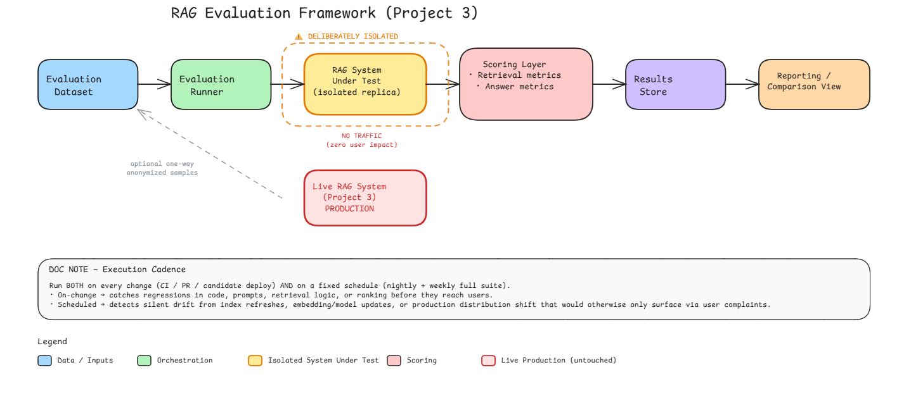
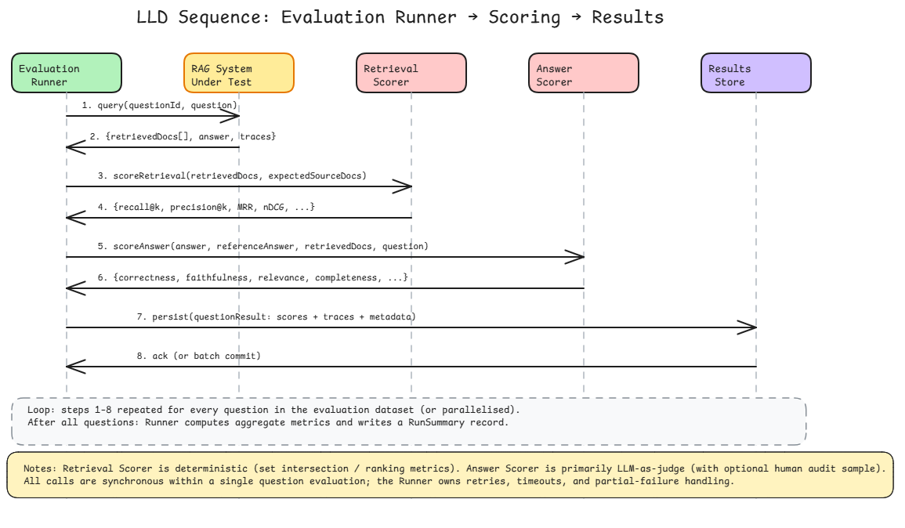

# RAG Evaluation Framework

---

## 1. Overview

This document describes the design and proof-of-concept for a RAG Evaluation Framework that measures retrieval and answer quality against a versioned, gold-standard evaluation dataset.

The framework is deliberately isolated from the live production RAG system so that evaluation traffic never touches users. It runs on every change (CI / PR / candidate deploy) and on a fixed schedule (nightly + weekly full suite).

The core measurement loop is:

```
question -> retrieve -> compare against expectedSourceDocs -> emit metrics
```

A minimal Java proof-of-concept (`RetrievalEvalDemo.java`) demonstrates that this loop works end-to-end on 5 sample questions with a bag-of-words retriever over a tiny in-memory corpus.

---

## 2. Architecture

### 2.1 High-Level Design (HLD)



The framework is a six-stage left-to-right pipeline:

**Evaluation Dataset → Evaluation Runner → RAG System Under Test → Scoring Layer → Results Store → Reporting / Comparison View**

Each stage has a distinct responsibility:

**Evaluation Dataset** — A curated set of questions, each paired with expected source documents and (optionally) a reference answer. The dataset can be hand-authored or augmented with anonymized samples drawn one-way from the live production system.

**Evaluation Runner** — The orchestration engine. It iterates over every question in the dataset, dispatches each question to the RAG system under test, collects the response, fans out to the scoring layer, and persists results. It owns retries, timeouts, and partial-failure handling.

**RAG System Under Test (isolated replica)** — A deliberately isolated copy of the Project 3 RAG system. It is walled off from the live production deployment so that evaluation workloads produce zero user impact. The isolation boundary is marked explicitly in the architecture: no traffic flows between the replica and the production system.

**Scoring Layer** — Computes two families of metrics. Retrieval metrics (recall@k, precision@k, MRR, nDCG, hit rate) are deterministic set-intersection and ranking calculations. Answer metrics (correctness, faithfulness, relevance, completeness) are primarily LLM-as-judge evaluations with an optional human-audit sample.

**Results Store** — Persists per-question scores, traces, and metadata so that every evaluation run is fully reproducible and auditable.

**Reporting / Comparison View** — A dashboard or report that surfaces aggregate metrics, per-question drill-downs, and run-over-run comparisons to make regressions and improvements visible at a glance.

#### Production Isolation

The live RAG system (Project 3, production) sits below the evaluation pipeline and is explicitly **untouched** by evaluation traffic. The only permitted data flow from production into the evaluation world is a one-way, anonymized sample feed into the Evaluation Dataset — and even that is optional.

#### Execution Cadence

The framework is designed to run in two modes:

**On-change (CI / PR / candidate deploy)** — catches regressions in code, prompts, retrieval logic, or ranking before they reach users.

**Scheduled (nightly + weekly full suite)** — detects silent drift from index refreshes, embedding/model updates, or production distribution shift that would otherwise only surface via user complaints.

#### Legend

| Color | Meaning |
|---|---|
| Blue | Data / Inputs |
| Green | Orchestration |
| Orange | Isolated System Under Test |
| Pink | Scoring |
| Red | Live Production (untouched) |

### 2.2 Low-Level Design (LLD)



The LLD sequence involves five participants, each shown as a swim-lane:

| Participant | Role |
|---|---|
| Evaluation Runner | Orchestrator; drives the loop and aggregates results |
| RAG System Under Test | The isolated replica that receives the question and returns documents + an answer |
| Retrieval Scorer | Deterministic scorer for document retrieval quality |
| Answer Scorer | Primarily LLM-as-judge scorer for answer quality |
| Results Store | Persistence layer for scores, traces, and metadata |

#### Per-Question Sequence (Steps 1–8)

For each question in the evaluation dataset the following synchronous sequence executes:

**Step 1** — The Evaluation Runner sends `query(questionId, question)` to the RAG System Under Test.

**Step 2** — The RAG System responds with `{retrievedDocs[], answer, traces}`.

**Step 3** — The Runner calls the Retrieval Scorer: `scoreRetrieval(retrievedDocs, expectedSourceDocs)`.

**Step 4** — The Retrieval Scorer returns `{recall@k, precision@k, MRR, nDCG, ...}`.

**Step 5** — The Runner calls the Answer Scorer: `scoreAnswer(answer, referenceAnswer, retrievedDocs, question)`.

**Step 6** — The Answer Scorer returns `{correctness, faithfulness, relevance, completeness, ...}`.

**Step 7** — The Runner sends `persist(questionResult: scores + traces + metadata)` to the Results Store.

**Step 8** — The Results Store returns an acknowledgement (or batch commit confirmation).

#### Loop and Aggregation

Steps 1–8 repeat for every question in the evaluation dataset (questions may be parallelized). After all questions complete, the Runner computes aggregate metrics and writes a `RunSummary` record to the Results Store.

#### Design Notes

The Retrieval Scorer is fully deterministic — it performs set intersection and ranking calculations against the expected source documents. The Answer Scorer is primarily LLM-as-judge, optionally supplemented by a human audit sample for calibration. All calls within a single question evaluation are synchronous; the Runner owns retries, timeouts, and partial-failure handling across the full run.

---

## 3. Evaluation Dataset Schema

### Core Record (JSON)

```json
{
  "questionId": "string (stable UUID or human-readable slug)",
  "question": "string",
  "expectedSourceDocs": [
    {
      "docId": "string",
      "passageId": "string (optional)",
      "relevance": "number 0-3 or boolean (optional graded relevance)"
    }
  ],
  "referenceAnswer": "string (or array of acceptable answers)",
  "metadata": {
    "domain": "string",
    "difficulty": "easy | medium | hard",
    "questionType": "factual | multi-hop | comparison | ...",
    "tags": ["string"],
    "source": "curated | synthetic | production-sample",
    "createdBy": "string (user or system)",
    "createdAt": "ISO-8601",
    "lastReviewedAt": "ISO-8601",
    "reviewer": "string"
  }
}
```

### Dataset Composition

| Source | Share | Owner |
|---|---|---|
| Human-curated gold | 40–60% | Evaluation team + SME review |
| Verified synthetic | 20–30% | Evaluation team |
| Anonymised production samples | 15–25% | Evaluation team (promoted after review) |

### Dataset Governance

**Versioning** — Every dataset has a semantic version (e.g. v1.3.0). Evaluation runs pin the exact version.

**Drift detection** — Monthly review of production sample distribution vs gold set; new "hard" questions are promoted into gold when they expose systematic failures.

**Deprecation** — Questions whose expectedSourceDocs no longer exist in the index are flagged and either updated or retired.

Without a named owner and a review process, the dataset rots and the metrics become meaningless.

---

## 4. Retrieval Metrics

| Metric | Definition (simplified) | Why we keep it | What a drop tells you |
|---|---|---|---|
| Recall@k (k=5,10) | Fraction of expectedSourceDocs that appear in the top-k retrieved | Primary signal of "did we even surface the right knowledge?" | Retriever or index is missing relevant content, or ranking has pushed good docs below k. Most common regression after embedding / index changes. |
| Precision@k | Fraction of the top-k that are relevant | Measures noise in the context window | Retriever is returning more junk; can cause answer hallucination or dilution even if recall is high. |
| MRR (Mean Reciprocal Rank) | Average of 1/rank of the first relevant doc | Sensitive to where the first useful doc sits | First relevant doc is being ranked lower → ranking model / hybrid fusion regression. |
| nDCG@k | Position-aware graded relevance | Captures graded relevance when docs have different importance scores | Overall ranking quality is degrading; useful when relevance is graded. |
| Hit Rate@k | Binary: at least one expected doc in top-k | Simple "did we succeed at all" | Catastrophic retrieval failure (index empty, wrong collection, embedding model mismatch). |

**Design choice:** We always report both hard metrics (against expectedSourceDocs) and a soft context-relevance score (LLM or embedding similarity of retrieved passages to the question). A drop in hard metrics with stable soft metrics usually means the gold labels are stale; a drop in both means real retrieval regression.

---

## 5. Answer Metrics

**Primary scoring method:** LLM-as-judge (with a fixed, versioned judge prompt and model).

Dimensions scored (0–5 or binary + rationale):

**Correctness / Factual accuracy** — Does the answer match the referenceAnswer (or contain the key facts)?

**Faithfulness / Groundedness** — Is every claim supported by the retrievedDocs?

**Relevance** — Does the answer actually address the question?

**Completeness** — Are the important points from the reference covered?

**Citation quality (optional)** — Are citations present and correct?

### Secondary / Calibration

A small human-audited sample (5–10%) runs every major evaluation to measure judge agreement. Deterministic checks are used where possible — exact match on short answers, presence of required entities, and refusal correctness.

### Known LLM-as-Judge Weaknesses

**Position & verbosity bias** — Longer or earlier answers often score higher.

**Self-preference / model family bias** — The judge tends to prefer answers from the same model family.

**Inconsistency** — The same answer can receive different scores across runs (mitigated by temperature=0 + multiple samples + majority vote).

**Cost & latency** — Non-trivial at scale; hence we cache judge results keyed by (answer hash + judge version).

**Prompt sensitivity** — Small prompt changes move scores; therefore the judge prompt is versioned and pinned per evaluation run.

Because of these weaknesses we never treat a single LLM score as absolute truth. Regression detection always looks at relative change against a pinned baseline run on the same dataset version, and we keep a human-audit loop.

---

## 6. Results Schema

### 6.1 Run-Level Record (JSON)

```json
{
  "runId": "uuid",
  "timestamp": "ISO-8601",
  "datasetVersion": "v1.3.0",
  "ragCommit": "git sha or image digest",
  "ragConfig": {
    "embeddingModel": "..",
    "indexVersion": "..",
    "llm": "..",
    "promptVersion": ".."
  },
  "judgeModel": "string",
  "judgePromptVersion": "string",
  "trigger": "ci | scheduled | manual",
  "aggregateMetrics": {
    "retrieval": { "recall@5": 0.82, "mrr": 0.71, "...": "..." },
    "answer": { "correctness": 0.78, "faithfulness": 0.85, "...": "..." }
  },
  "regressionFlags": [
    {
      "metric": "recall@5",
      "baselineRunId": "...",
      "delta": -0.07,
      "threshold": -0.05,
      "status": "REGRESSED"
    }
  ],
  "questionCount": 420,
  "durationSeconds": 1840
}
```

### 6.2 Per-Question Record (JSON)

```json
{
  "runId": "uuid",
  "questionId": "string",
  "retrievedDocs": [
    { "docId": "...", "score": 0.91, "rank": 1 }
  ],
  "generatedAnswer": "string",
  "retrievalScores": { "recall@5": 1.0, "mrr": 1.0, "...": "..." },
  "answerScores": {
    "correctness": 4,
    "faithfulness": 5,
    "relevance": 5,
    "rationale": "..."
  },
  "traces": {
    "retrievalLatencyMs": 120,
    "generationLatencyMs": 890,
    "rawContext": "..."
  },
  "error": null
}
```

### 6.3 Comparison & Regression Logic

Two runs are comparable only when `datasetVersion` is identical. For each metric we compute delta vs the designated baseline (usually the last "green" main-branch run or a pinned golden run). A metric is flagged `REGRESSED` when delta < configured threshold (e.g. −5% absolute or −10% relative).

The Reporting view surfaces both aggregate deltas and the concrete questions that flipped from pass → fail, so engineers can inspect the exact `retrievedDocs` and `generatedAnswer`.

This schema gives a complete, reproducible audit trail: you can always answer "why did the score drop and on which questions?" without re-running the system.

---

## 7. Proof-of-Concept: RetrievalEvalDemo.java

A minimal Java program that proves the measurement loop works end-to-end.

### What It Does

The demo defines a tiny in-memory corpus of 8 policy documents, defines 5 sample questions with `expectedSourceDocs`, implements a simple bag-of-words cosine-similarity retriever (stand-in for the real retriever), and computes Recall@k, Precision@k, MRR, and HitRate@k per question. It prints per-question scores and aggregate Recall@3 / MRR.

### Corpus

| Document ID | Topic |
|---|---|
| `doc_payroll_policy` | Pay schedule and overtime rules |
| `doc_leave_policy` | Annual leave, sick leave, maternity leave |
| `doc_expense_policy` | Travel pre-approval, receipts, meal caps |
| `doc_security_policy` | Disk encryption, password policy, MFA |
| `doc_onboarding` | IT setup, HR orientation, buddy assignment |
| `doc_remote_work` | Remote work allowance, home office stipend, VPN |
| `doc_benefits` | Health insurance, 401k matching, gym reimbursement |
| `doc_code_of_conduct` | Harassment policy, conflicts of interest, gift limits |

### Evaluation Dataset

| ID | Question | Expected Doc |
|---|---|---|
| q1 | When are employees paid and how is overtime calculated? | `doc_payroll_policy` |
| q2 | How many days of annual leave do I get and what about sick leave? | `doc_leave_policy` |
| q3 | What is the policy for travel expenses and meal limits? | `doc_expense_policy` |
| q4 | Do I need MFA for VPN and how often must I change my password? | `doc_security_policy` |
| q5 | Can I work from home and is there a home office stipend? | `doc_remote_work` |

### Retrieval Method

The demo uses a simple bag-of-words cosine similarity retriever as a stand-in for the production retriever. Documents and queries are tokenized into lowercased alphanumeric tokens, converted to normalized term-frequency vectors, and ranked by cosine similarity. The top-k documents are returned for scoring.

### Sample Output

```
[q1] ... Recall@3: 1.00   MRR: 1.00
[q2] ... Recall@3: 1.00   MRR: 1.00
[q3] ... Recall@3: 1.00   MRR: 0.50   ← first relevant doc ranked 2nd
[q4] ... Recall@3: 1.00   MRR: 1.00
[q5] ... Recall@3: 1.00   MRR: 1.00
AGGREGATE   Recall@3: 1.000   MRR: 0.900
```

### Key Code Structures

The demo defines two record types:

`EvaluationItem(questionId, question, expectedSourceDocs)` — one row in the evaluation dataset.

`RankedDocument(documentId, score)` — one retrieval result with its similarity score.

The metric functions (`recallAtK`, `precisionAtK`, `mrr`, `hitRateAtK`) are pure, stateless calculations that accept a list of retrieved document IDs, a list of expected document IDs, and (where applicable) k. They are intentionally separated from the retrieval logic so they can be reused unchanged in the production Evaluation Runner.

**Key point:** This is deliberately minimal — the same metric functions the Evaluation Runner will call. In production, the same functions are called by the Evaluation Runner.

---

## 8. Decision Log

| Decision | Choice | Rationale |
|---|---|---|
| Retrieval metrics | Recall@5/10 + MRR + nDCG@10, Precision@k secondary | Directly surface "missing knowledge" (Recall), ranking quality of first useful doc (MRR), and graded position-aware quality (nDCG); Precision@k is secondary to detect context noise. |
| Answer metrics | LLM-as-judge on correctness, faithfulness, relevance, completeness | Scalable and covers RAG failure modes; deterministic exact-match used only for short factual answers. |
| Dataset | 40–60% human-curated gold, 20–30% verified synthetic, 15–25% anonymised production samples | Versioned in git, monthly distribution drift check, questions retired when expectedSourceDocs disappear. |
| Judge bias mitigation | temperature=0 + majority of 3 samples, judge prompt & model pinned per run, 5–10% human audit | Scores always compared relatively to a pinned baseline on the identical dataset version (never absolute). |
| Blocking regression threshold | Any critical metric drops ≥5% absolute or ≥10% relative vs last green baseline on same datasetVersion → fail CI / block promotion | Reserves the gate for metrics whose movement we can defend to stakeholders as "users will notice." Non-critical metrics can warn without blocking. |

---

## 9. Review — Defence of Metric Choices & Regression Threshold

### Why These Retrieval Metrics

Recall@k answers the only question that matters for RAG: "Did the right knowledge even appear in the context window?" If it drops, the generator never had a chance.

MRR tells you where the first useful doc landed. A drop from 1.0 → 0.5 means the relevant doc moved from rank 1 to rank 2; that is often enough to change the generated answer.

nDCG (when we have graded labels) and Precision@k catch ranking noise and context pollution. We do not rely on a single number; the combination separates "missing content" failures from "ranking" failures.

### What a Drop from 0.8 → 0.7 Actually Means

**On Recall@5:** Roughly 10% of the questions that previously had their gold documents in the top-5 no longer do. In absolute terms, on a 400-question set that is ~40 questions whose correct source is now missing from the context the LLM sees. Those questions will either hallucinate, refuse, or give incomplete answers.

**On MRR:** The average reciprocal rank of the first relevant document fell. Concretely, a fall of 0.1 usually means a noticeable fraction of questions had their best document pushed one or more positions lower — enough to change which passages the generator attends to.

These are not abstract percentages; they map directly to the number of user-facing failures you will see if the change ships.

### Regression Threshold That Blocks

Any critical metric (Recall@5, MRR, answer correctness, faithfulness) drops ≥5% absolute or ≥10% relative versus the last green baseline on the same `datasetVersion` → CI fails / promotion is blocked.

**Why 5% absolute?** On a well-maintained gold set a 5-point drop is already larger than normal run-to-run variance and reliably correlates with visible answer degradation. Relative 10% protects smaller baseline numbers. Both must be measured on an identical, version-pinned dataset so the comparison is apples-to-apples. Non-critical metrics (Precision@k, soft relevance) can warn without blocking; the gate is reserved for metrics whose movement we can defend to stakeholders as "users will notice."

---

## 10. Summary

| Component | Purpose |
|---|---|
| Evaluation Dataset | Versioned, owned, reviewed gold set of questions + expected source docs + reference answers |
| Evaluation Runner | Orchestrates query → retrieve → score → persist per question; owns retries, timeouts, partial-failure handling |
| RAG System Under Test | Isolated replica; zero user traffic |
| Retrieval Scorer | Deterministic set/ranking metrics (Recall@k, Precision@k, MRR, nDCG, HitRate) |
| Answer Scorer | LLM-as-judge on correctness, faithfulness, relevance, completeness; pinned model + prompt |
| Results Store | Per-question + run-level records for full reproducibility and comparison |
| Reporting / Comparison View | Aggregate deltas + concrete pass→fail question flips |

The framework provides a complete, reproducible audit trail — you can always answer "why did the score drop and on which questions?" without re-running the system.
