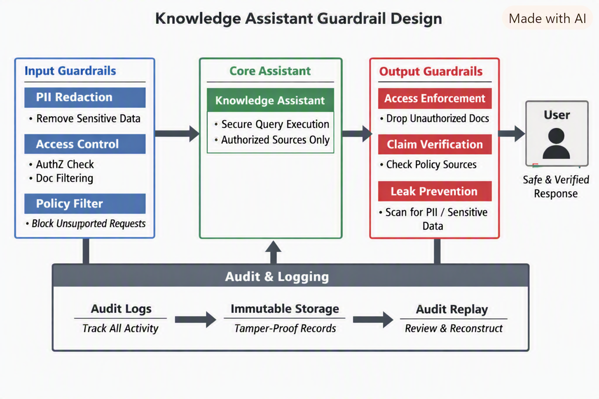
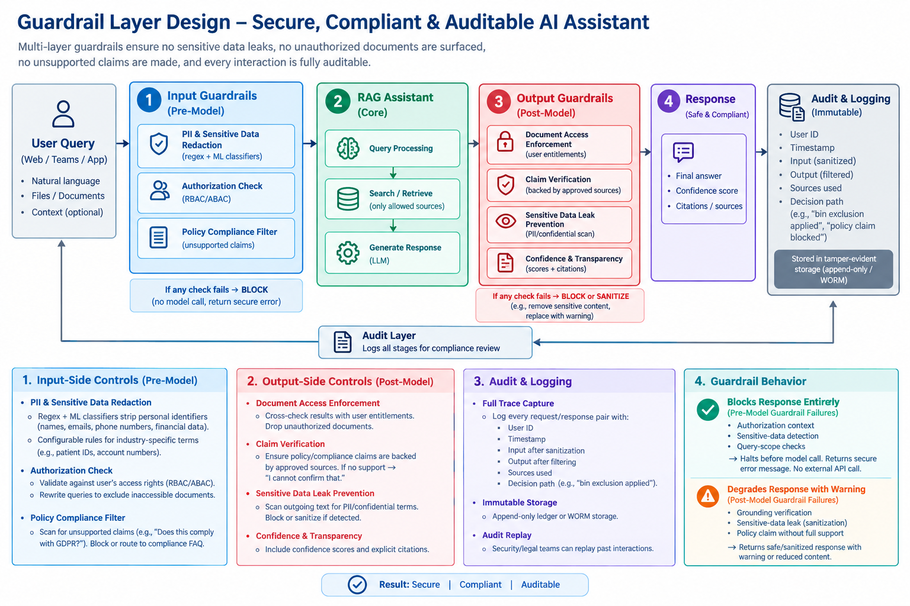
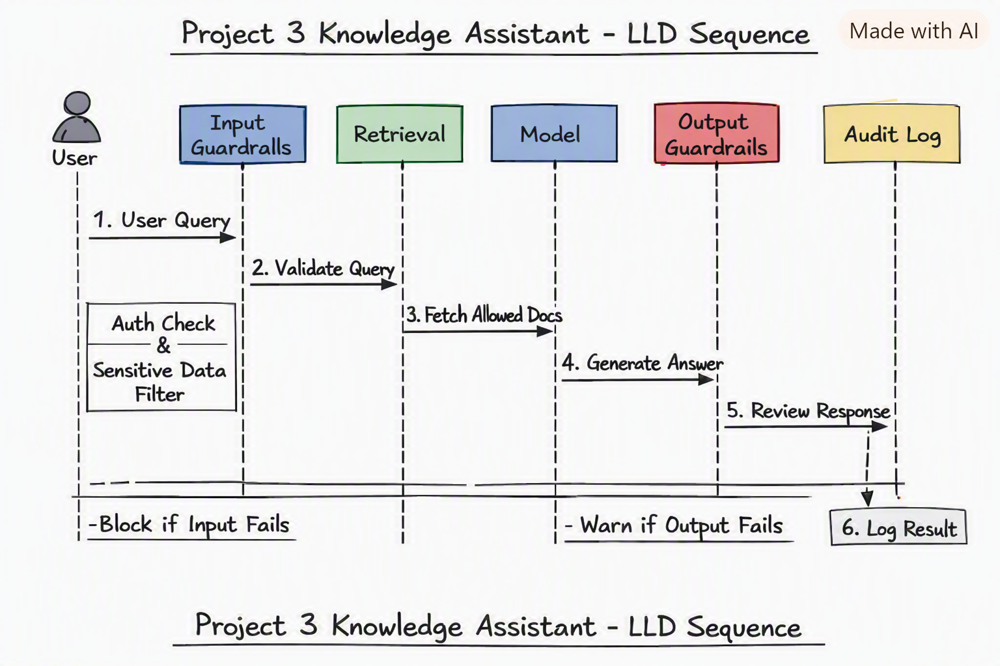

# Guardrail Layer Design

## 1. Input-Side Controls

### PII & Sensitive Data Redaction

- Regex + ML classifiers strip out personal identifiers (names, emails, phone numbers, financial data) before any request leaves the enterprise boundary.
- Configurable rules for industry-specific sensitive terms (e.g., patient IDs in healthcare, account numbers in finance).

### Authorization Check

- Every document or knowledge source request is validated against the user’s access rights (RBAC/ABAC).
- Queries are rewritten to exclude references to documents the user cannot see.

### Policy Compliance Filter

- Input is scanned for requests that would trigger unsupported claims (e.g., “Does this comply with GDPR?”). Such queries are either blocked or routed to a compliance FAQ rather than the model.

## 2. Output-Side Controls

### Document Access Enforcement

- Before surfacing retrieved content, results are cross-checked against the user’s entitlements. Unauthorized documents are dropped from the response.

### Claim Verification

- Any assistant statement that looks like a policy or compliance claim must be backed by a citation from an approved source (policy database, legal text). If no support exists, the assistant responds with “I cannot confirm that.”

### Sensitive Data Leak Prevention

- Outgoing text is scanned again for PII or confidential terms. If detected, the response is blocked or sanitized.

### Confidence & Transparency

- Responses include confidence scores and explicit citations so auditors can verify what source supported each claim.

## 3. Audit & Logging

### Full Trace Capture

Every request/response pair is logged with:
- User ID
- Timestamp
- Input after sanitization
- Output after filtering
- Sources used
- Decision path (e.g., “bin exclusion applied,” “policy claim blocked”).

### Immutable Storage

- Logs written to tamper-evident storage (e.g., append-only ledger or WORM storage).

### Audit Replay

- Security/legal teams can replay a past interaction to see exactly what the assistant saw and produced.

## 4. Architecture Overview

### Pre-Processor (Input Guardrail)

- Redaction → AuthZ check → Policy filter

### Core Assistant

- Executes query only on allowed sources

### Post-Processor (Output Guardrail)

- Access enforcement → Claim verification → Leak prevention

### Audit Layer

- Logs all stages for compliance review

✅ **This design ensures:**
- No sensitive data leaks to external APIs.
- No unauthorized documents are surfaced.
- No unsupported policy claims are made.
- Every interaction is auditable after the fact.

---

## Deliverable 1 – HLD Diagram

**Boxes:** User Query → Input Guardrails (authorization context, sensitive-data detection, query scope check) → RAG Assistant (Project 3) → Output Guardrails (grounding verification, sensitive-data scan, policy check) → Response + Audit Log.

Show explicitly which checks happen before the model call and which after — that split is the main design decision here.

Include a short doc note: which guardrail failures block a response entirely versus which degrade it with a warning.

### Doc Note: Guardrail Behavior

#### Pre-Model Guardrail Failures (Input side)

- **Authorization context**, **sensitive-data detection**, and **query-scope checks** are *blocking*.
- If any fail, the assistant halts before calling the model and returns a secure error message — no external API call occurs.

#### Post-Model Guardrail Failures (Output side)

- **Grounding verification**, **sensitive-data scan**, and **policy check** are *degrading*.
- The assistant still returns a response but attaches a warning banner (e.g., “Some content omitted for compliance”) and logs the event for audit.

This split — **blocking before model call, degrading after** — is the key design decision ensuring both **data containment** and **transparent user experience**.

---

## Deliverable 2 – Low-Level Design (LLD)

### Sequence Diagram Overview

**Lifelines:** 1️⃣ User → 2️⃣ Input Guardrails → 3️⃣ Retrieval Layer → 4️⃣ Model Generation → 5️⃣ Output Guardrails → 6️⃣ Audit Log

```
User ──► Input Guardrails ──► Retrieval ──► Model ──► Output Guardrails ──► Audit Log
```

### Flow (numbered)

1. **User Query** arrives.
2. **Input Guardrails** perform:
   - Authorization context check
   - Sensitive-data detection
   - Query-scope validation → If any fail, block before model call.
3. **Retrieval Layer** fetches documents only from sources user is authorized for.
4. **Model Generation** runs RAG using retrieved context.
5. **Output Guardrails** verify grounding, rescan for sensitive data, and apply policy checks.
6. **Audit Log** records all stages and outcomes.

### Authorization Model

- **Document-level permissions enforced both *before* and *after* retrieval.**
  - **Pre-retrieval filter:** Query expansion limited to indices the user can access (RBAC/ABAC). Prevents exposure of restricted metadata.
  - **Post-retrieval filter:** After retrieval, each document’s ID is rechecked against live entitlements before passing to the model.
  - **Justification:**
    - Pre-filter prevents leakage in retrieval queries.
    - Post-filter ensures consistency if permissions changed mid-session.
    - Dual enforcement guarantees zero unauthorized grounding.

### Sensitive-Data Handling

- **Detection:**
  - Regex + ML classifiers for PII, credentials, financial, medical, or contract terms.
- **Actions:**
  - **Critical data (e.g., passwords, SSNs):** Block entirely.
  - **Moderate sensitivity (e.g., names, emails):** Redact before model call.
  - **Contextual sensitivity (e.g., confidential project terms):** Route to an *isolated model deployment* with no external API exposure.
- **Outcome:** Ensures no sensitive tokens leave the enterprise boundary.

### Grounding Verification

- **Mechanism:**
  - Compare generated answer embeddings against retrieved context embeddings.
  - Compute cosine similarity threshold (e.g., ≥ 0.85).
  - If unsupported sentences detected → mark as “unverified” and downgrade response confidence.
- **Fallback:**
  - If grounding fails entirely, return “Unable to confirm answer from authorized sources.”
- **Purpose:** Guarantees factual alignment with retrieved documents.

### Audit Record Schema

| Field | Description |
| --- | --- |
| **requestId** | Unique UUID per query |
| **userId** | Authenticated user identifier |
| **query** | Sanitized input text |
| **retrievedDocIds[]** | Array of document IDs used |
| **guardrailResults** | JSON object summarizing pass/fail per guardrail |
| **responseSummary** | Short text of final output or warning |
| **timestamp** | ISO 8601 UTC time |
| **modelVersion** | Identifier of model used |
| **confidenceScore** | Numeric grounding confidence |
| **policyFlags[]** | Any triggered compliance rules |

**Retention Policy:**
- Store for **12 months** in tamper-evident storage (WORM or ledger).
- After expiry, anonymize userId and purge sensitive fields while retaining aggregate metrics for compliance analytics.

✅ This LLD ensures **authorization, sensitivity, grounding, and auditability** are enforced at every stage — with clear separation of **blocking pre-model checks** and **degrading post-model checks** for transparency and safety.

---

## Pipeline Flow

1. Query received with the caller's identity and permissions
2. Input guardrails run – scope check, sensitive-data check
3. Retrieval executed under the user's permission scope
4. Model generates a grounded answer
5. Output guardrails run – grounding check, sensitive-data scan
6. Blocked / degraded / passed decision → response returned
7. Audit record written regardless of outcome

---

## Java Demonstration – Permission-Filtered Retrieval Guardrail

```java
import java.util.*;

public class GuardrailDemo {

    // Mock document store with per-document access lists
    static class Document {
        String id;
        String content;
        Set<String> allowedUsers;

        Document(String id, String content, String... allowed) {
            this.id = id;
            this.content = content;
            this.allowedUsers = new HashSet<>(Arrays.asList(allowed));
        }
    }

    // Guardrail: filters retrieval by user permissions
    static List<Document> retrieveDocuments(String userId, List<Document> allDocs) {
        List<Document> visible = new ArrayList<>();
        for (Document doc : allDocs) {
            if (doc.allowedUsers.contains(userId)) {
                visible.add(doc);
            }
        }
        // Audit log entry
        System.out.printf("Audit: user=%s retrieved=%s%n",
                userId,
                visible.stream().map(d -> d.id).toList());
        return visible;
    }

    public static void main(String[] args) {
        // Mock corpus
        List<Document> corpus = List.of(
                new Document("DOC-001", "Quarterly financial report", "alice"),
                new Document("DOC-002", "R&D roadmap", "alice", "bob"),
                new Document("DOC-003", "HR salary data", "hradmin")
        );

        // Two users
        String userA = "alice";
        String userB = "charlie";

        // Guardrail in action
        System.out.println("=== Retrieval for Alice ===");
        retrieveDocuments(userA, corpus).forEach(d -> System.out.println(d.content));

        System.out.println("\n=== Retrieval for Charlie ===");
        retrieveDocuments(userB, corpus).forEach(d -> System.out.println(d.content));

        // Expected output:
        // Alice sees DOC-001 and DOC-002
        // Charlie sees nothing (guardrail blocks unauthorized access)
    }
}
```

### How it works

- Each document carries an **access list**.
- The `retrieveDocuments` method enforces the **authorization guardrail** by filtering only those documents the user is permitted to view.
- Every retrieval attempt is **audited** with user ID and document IDs.
- Unauthorized users (like *Charlie*) get an empty result — the guardrail blocks exposure end-to-end.
- This pattern mirrors the enterprise guardrail principle: **authorization enforced before retrieval, audit logged after**, ensuring zero leakage and full traceability.

---

## Decision Log

1. **Pre-call checks:** Authorization, sensitive-data detection, and query-scope validation run *before* the model call to prevent any restricted or confidential data from reaching the provider API.
2. **Post-call checks:** Grounding verification, sensitive-data rescan, and policy compliance run *after* generation to validate factual support and ensure no leaks in the output.
3. **Permission filtering:** Dual enforcement — pre-retrieval limits queries to accessible indices; post-retrieval re-validates document IDs against live entitlements to catch mid-session permission changes.
4. **Blocking failures:** Missing authorization, detected critical PII (e.g., passwords, SSNs), or invalid query scope immediately halt execution; no model call occurs.
5. **Latency trade-off:** Accepted ~80–120 ms overhead per query for guardrail checks (mostly entitlement lookups and embedding similarity scoring) to guarantee compliance and auditability.
